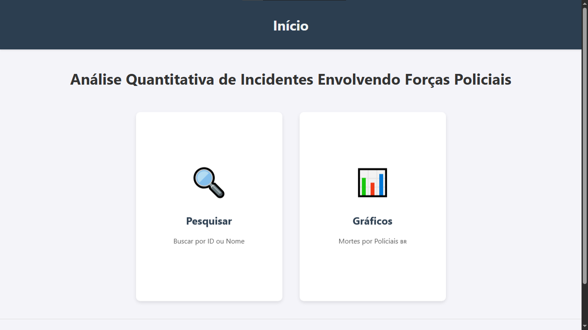
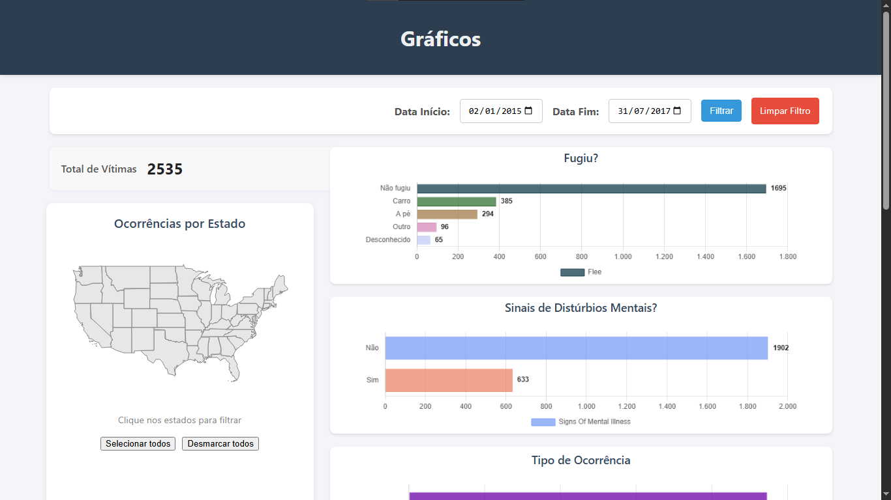

<div align="center">
    <h1>Dashboard de Análise de Incidentes Policiais</h1>
</div>

<p align="center">
  Uma aplicação web interativa desenvolvida com Python, Flask e Pandas para análise quantitativa de incidentes envolvendo forças policiais nos EUA.
  <br />
  <a href="#key-features"><strong>Explore os Recursos »</strong></a>
  <br />
  <br />
</p>

---

## Sobre o Projeto

Este projeto é um dashboard interativo que permite a visualização e filtragem de dados sobre incidentes fatais envolvendo policiais nos Estados Unidos. A aplicação foi construída utilizando o **Flask**, um micro-framework Python, para criar a interface web e gerenciar as rotas. A manipulação, limpeza e análise dos dados são realizadas pela poderosa biblioteca **Pandas**, que carrega as informações de um arquivo CSV.

O objetivo é fornecer uma ferramenta clara e intuitiva para explorar diversas facetas desses incidentes, como demografia das vítimas, localização geográfica e circunstâncias das ocorrências, tudo isso em uma interface web amigável e com suporte a múltiplos idiomas.

### Tecnologias e Conceitos Chave

-   **Flask:** Utilizado como a espinha dorsal da aplicação web. Ele gerencia as URLs (rotas), renderiza as páginas HTML e serve como a ponte entre o front-end (o que o usuário vê) e o back-end (a lógica de dados).
-   **Pandas:** Essencial para a manipulação dos dados. Usei o Pandas para carregar o arquivo `Deaths_by_Police_US.csv` em um DataFrame, limpar colunas, tratar valores ausentes e realizar os cálculos e agrupamentos necessários para gerar os gráficos.
-   **Chart.js:** Biblioteca JavaScript usada para renderizar os gráficos interativos no navegador, tornando a visualização dos dados dinâmica e agradável.
-   **`webbrowser.open_new('http://127.0.0.1:5000/')`:** Adicionei este comando no script `run.py` para melhorar a experiência do usuário. Ele simplesmente abre o navegador padrão do seu computador automaticamente na página do dashboard assim que o servidor Flask é iniciado.
-   **`SECRET_KEY`:** Esta é uma configuração de segurança crucial no Flask. Ela é usada para "assinar" e proteger os dados da sessão do usuário (como a preferência de idioma, neste projeto). No arquivo `config.py`, a chave é obtida de uma variável de ambiente (prática segura para produção) ou gerada aleatoriamente com `secrets.token_urlsafe(32)` para facilitar o uso em ambiente de desenvolvimento.

<a name="key-features"></a>

### Key Features

-   **Dashboard Interativo:** Visualize dados agregados com gráficos de barra, pizza e um mapa dos EUA.
-   **Filtragem Dinâmica:** Filtre os dados por período (data de início e fim) e por estados, clicando diretamente no mapa. Todos os gráficos são atualizados em tempo real.
-   **Ferramenta de Pesquisa:** Busque por registros específicos no dataset por ID ou nome da vítima.
-   **Suporte a Múltiplos Idiomas:** A interface pode ser alternada entre Português e Inglês.
-   **Estrutura Escalável:** O projeto segue o padrão *Application Factory* do Flask, tornando o código organizado, modular e fácil de dar manutenção.

### Screenshots

<p align="center">
  
  <br>
  <em>Página inicial com as opções de navegação.</em>
</p>

<p align="center">
  
  <br>
  <em>Dashboard completo com mapa e gráficos.</em>
</p>

<p align="center">
  
  <br>
  <em>Visualização com filtro por estados aplicado.</em>
</p>

<p align="center">
  
  <br>
  <em>Resultados da ferramenta de pesquisa.</em>
</p>

<p align="center">
  
  <br>
  <em>Exemplo da funcionalidade de tradução.</em>
</p>

### Vídeo de Demonstração

<p align="center">
  <a href="https://youtu.be/1QrPYc78b5M" target="_blank">
    
  </a>
  <br>
  <em>Assista a uma demonstração completa do projeto no YouTube.</em>
</p>

### Tech Stack

Este projeto foi construído com as seguintes tecnologias:

-   **Linguagem:** Python 3
-   **Framework Web:** Flask
-   **Bibliotecas Python:** Pandas, Matplotlib, Numpy
-   **Front-end:** HTML, CSS, Chart.js, Leaflet.js

---

### Como Começar

#### Pré-requisitos

-   Python 3.x instalado no seu sistema
-   `pip` (gerenciador de pacotes do Python)

#### Instalação e Execução

1.  **Clone o repositório:**
    ```sh
    git clone [https://github.com/NONATO-03/dashboard-python-policiais.git](https://github.com/NONATO-03/dashboard-python-policiais.git)
    ```
2.  **Navegue para o diretório do projeto:**
    ```sh
    cd dashboard-python-policiais
    ```
3.  **Crie e ative um ambiente virtual (recomendado):**
    ```sh
    # Windows
    python -m venv venv
    .\venv\Scripts\activate

    # Linux / macOS
    python3 -m venv venv
    source venv/bin/activate
    ```
4.  **Instale as dependências:**
    ```sh
    pip install -r requirements.txt
    ```
5.  **Execute a aplicação:**
    ```sh
    python run.py
    ```
    O seu navegador deverá abrir automaticamente em `http://127.0.0.1:5000/`.

### Autor

Desenvolvido com ❤️ por **Vitor Nonato Nascimento**.

-   **GitHub:** [https://github.com/NONATO-03](https://github.com/NONATO-03)
