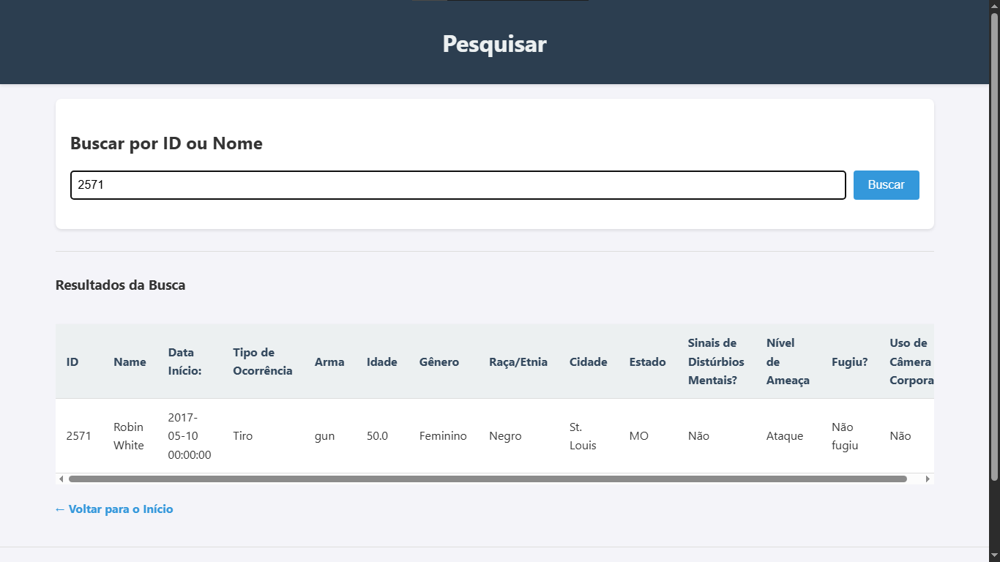

<div align="right">
    <a href="./README-pt.md">🇧🇷 Ler em Portuguese-Brazil</a>
</div>

<div align="center">
    <h1>Police Incident Analysis Dashboard</h1>
</div>

<p align="center">
  An interactive web application developed with Python, Flask, and Pandas for the quantitative analysis of incidents involving police forces in the US.
  <br />
  <a href="#key-features"><strong>Explore the Features »</strong></a>
  <br />
  <br />
</p>

---

## About the Project

This project is an interactive dashboard that allows for the visualization and filtering of data on fatal incidents involving police officers in the United States. The application was built using **Flask**, a Python micro-framework, to create the web interface and manage routes. Data manipulation, cleaning, and analysis are handled by the powerful **Pandas** library, which loads information from a CSV file.

The goal is to provide a clear and intuitive tool to explore various facets of these incidents, such as victim demographics, geographical location, and the circumstances of the occurrences, all within a user-friendly web interface with multi-language support.

### Key Technologies and Concepts

-   **Flask:** Used as the backbone of the web application. It manages URLs (routes), renders HTML pages, and serves as the bridge between the front-end (what the user sees) and the back-end (the data logic).
-   **Pandas:** Essential for data manipulation. I used Pandas to load the `Deaths_by_Police_US.csv` file into a DataFrame, clean columns, handle missing values, and perform the necessary calculations and groupings to generate the charts.
-   **Chart.js:** A JavaScript library used to render the interactive charts in the browser, making the data visualization dynamic and appealing.
-   **`webbrowser.open_new('http://127.0.0.1:5000/')`:** I added this command to the `run.py` script to improve the user experience. It simply opens your computer's default web browser to the dashboard's page as soon as the Flask server starts.
-   **`SECRET_KEY`:** This is a crucial security setting in Flask. It is used to "sign" and protect user session data (like the chosen language preference in this project). In the `config.py` file, the key is obtained from an environment variable (a secure practice for production) or generated randomly with `secrets.token_urlsafe(32)` to facilitate use in a development environment.

<a name="key-features"></a>

### Key Features

-   **Interactive Dashboard:** Visualize aggregated data with bar charts, pie charts, and a map of the USA.
-   **Dynamic Filtering:** Filter data by date range (start and end dates) and by state by clicking directly on the map. All charts update in real-time.
-   **Search Tool:** Look up specific records in the dataset by victim ID or name.
-   **Multi-language Support:** The interface can be switched between Portuguese and English.
-   **Scalable Structure:** The project follows Flask's *Application Factory* pattern, making the code organized, modular, and easy to maintain.

### Screenshots

<p align="center">
  
  <br>
  <em>Home page with navigation options.</em>
</p>

<p align="center">
  
  <br>
  <em>Full dashboard with map and charts.</em>
</p>

<p align="center">
  
  <br>
  <em>View with a state filter applied.</em>
</p>

<p align="center">
  
  <br>
  <em>Results from the search tool.</em>
</p>

<p align="center">
  
  <br>
  <em>Example of the translation feature.</em>
</p>

### Project Demo

<p align="center">
  <a href="https://youtu.be/1QrPYc78b5M" target="_blank">
    
  </a>
  <br>
  <em>Watch a full project demo on YouTube.</em>
</p>

### Tech Stack

This project was built with the following technologies:

-   **Language:** Python 3
-   **Web Framework:** Flask
-   **Python Libraries:** Pandas, Matplotlib, Numpy
-   **Front-end:** HTML, CSS, Chart.js, Leaflet.js

---

### Getting Started

#### Prerequisites

-   Python 3.x installed on your system
-   `pip` (Python package manager)

#### Installation & Setup

1.  **Clone the repository:**
    ```sh
    git clone [https://github.com/NONATO-03/dashboard-python-policiais.git](https://github.com/NONATO-03/dashboard-python-policiais.git)
    ```
2.  **Navigate to the project directory:**
    ```sh
    cd dashboard-python-policiais
    ```
3.  **Create and activate a virtual environment (recommended):**
    ```sh
    # Windows
    python -m venv venv
    .\venv\Scripts\activate

    # Linux / macOS
    python3 -m venv venv
    source venv/bin/activate
    ```
4.  **Install the dependencies:**
    ```sh
    pip install -r requirements.txt
    ```
5.  **Run the application:**
    ```sh
    python run.py
    ```
    Your browser should automatically open to `http://127.0.0.1:5000/`.

### Author

Developed with ❤️ by **Vitor Nonato Nascimento**.

-   **GitHub:** [https://github.com/NONATO-03](https://github.com/NONATO-03)
